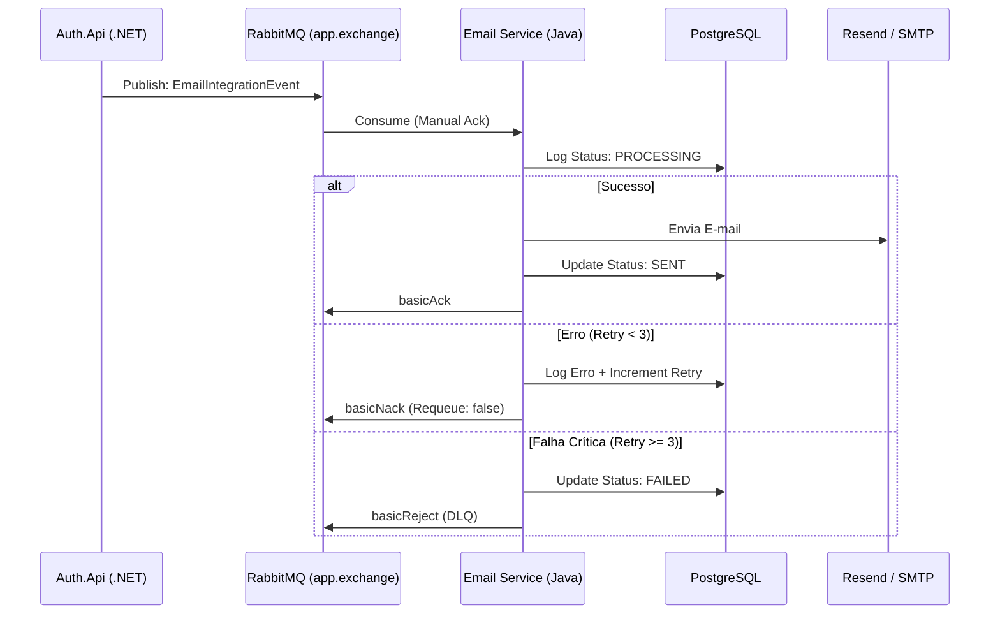

# 📧 Email Service - Worker de Mensageria Java

O **Email Service** é um microsserviço desenvolvido em **Java 25** com **Spring Boot 4**, especializado no processamento e disparo assíncrono de e-mails. Ele atua como um worker de alta performance que consome eventos do **RabbitMQ**, garantindo a entrega de comunicações críticas como recuperação de senha, boas-vindas e notificações do sistema.

---

## 🏗️ Papel no Ecossistema

Este serviço é o braço de comunicação externa do ecossistema, integrando-se nativamente com a `Auth.Api` e outros serviços via mensageria:

1.  **Consumo Resiliente:** Utiliza **Manual Acknowledgement (Ack)** para garantir que nenhuma mensagem seja perdida em caso de falha.
2.  **Política de Retry:** Implementa lógica de re-tentativa (até 3 vezes) com controle via headers do RabbitMQ (`x-retry-count`).
3.  **Abstração de Provedores:** Suporta múltiplos canais de envio, incluindo **SMTP tradicional** e o provedor **Resend**.
4.  **Logging e Auditoria:** Registra o histórico de envios em um banco de dados **PostgreSQL** para auditoria e monitoramento de saúde.

---

## 🚀 Tecnologias Utilizadas

*   **Platform:** [Java 25](https://openjdk.org/)
*   **Framework:** [Spring Boot 4.0.2](https://spring.io/projects/spring-boot)
*   **Messaging:** Spring AMQP (RabbitMQ) com Manual Ack
*   **Database:** PostgreSQL (via Spring Data JPA)
*   **Email Providers:** Spring Mail (SMTP) & [Resend SDK](https://resend.com/)
*   **Templates:** Thymeleaf (para e-mails HTML dinâmicos)
*   **Utilities:** Lombok, Actuator (Monitoramento)

---

## 🏗️ Arquitetura do Serviço

O serviço adota uma estrutura modular focada em escalabilidade:

*   **Consumer Layer:** `EmailConsumer` gerencia a escuta das filas e o ciclo de vida da mensagem (Ack/Nack/Reject).
*   **Service Layer:** Orquestra a escolha do provedor (`ResendService` ou `EmailService`), renderização de templates e persistência de logs.
*   **Domain Layer:** Entidades JPA para `EmailLog` e modelos de evento.

### Diagrama de Fluxo de Mensageria



---

## 🔌 Contrato de Evento

O `EmailConsumer` está configurado para desserializar o seguinte contrato:

```json
{
  "type": "RESET_PASSWORD",
  "to": "usuario@exemplo.com",
  "subject": "Redefinição de Senha",
  "body": "Seu link de acesso é...",
  "metadata": {
    "userId": "123",
    "userName": "Jovane"
  }
}
```

---

## ⚙️ Configuração Principal

As configurações sensíveis são gerenciadas via variáveis de ambiente (conforme `.env` local):

```properties
# RabbitMQ
rabbit.email-queue=email-service.queue
spring.rabbitmq.host=localhost

# Email (Resend)
resend.api-key=re_123456789

# Database
spring.datasource.url=jdbc:postgresql://localhost:5432/EmailDb
```

---

## 🛠️ Como Executar

1.  **Pré-requisitos:**
    *   Java 25 SDK
    *   Maven 3.9+
    *   Instância de PostgreSQL e RabbitMQ

2.  **Instalação:**
    ```bash
    mvn clean install
    ```

3.  **Execução:**
    ```bash
    mvn spring-boot:run
    ```

---

## 📝 Licença

Desenvolvido para fins de estudo e portfólio por **Jovane Sousa**.
